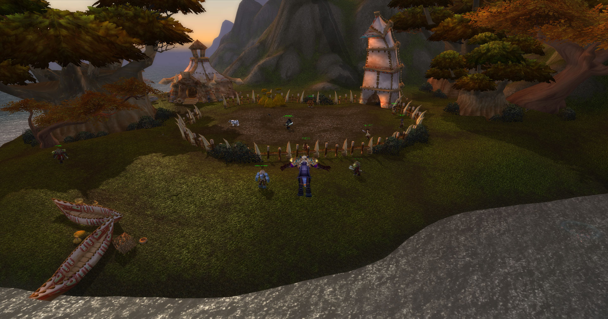
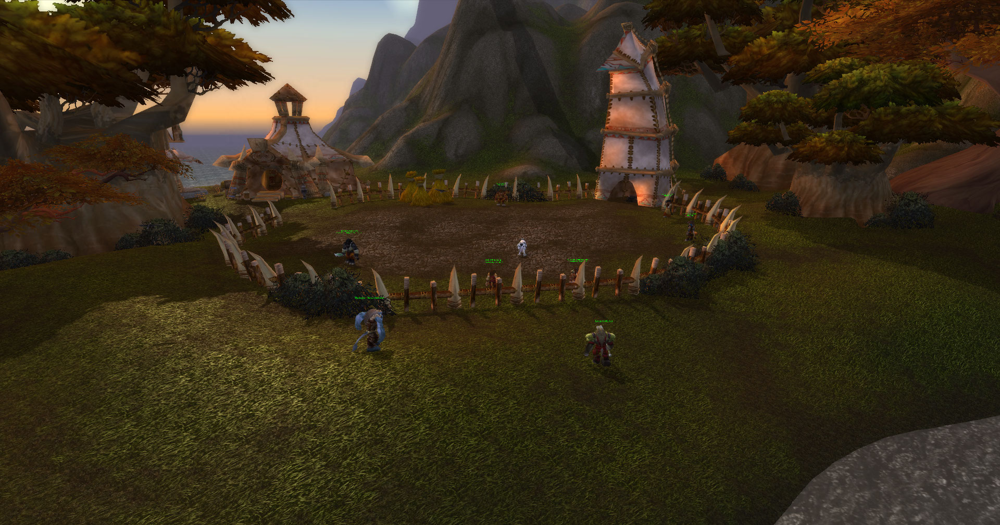
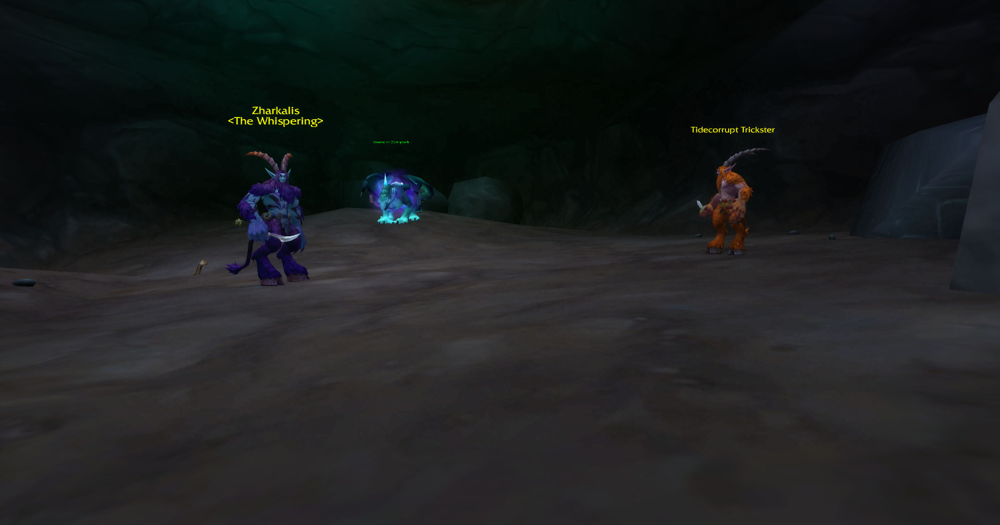
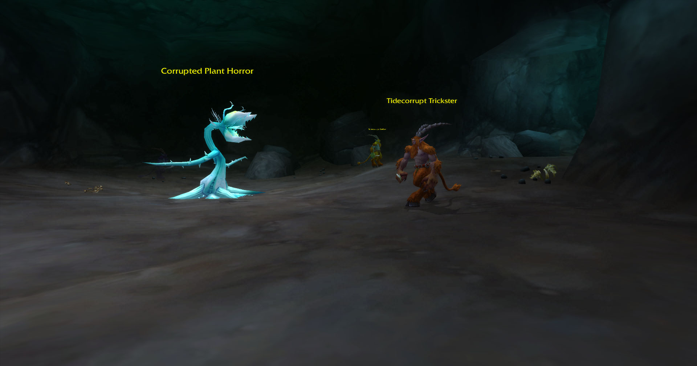
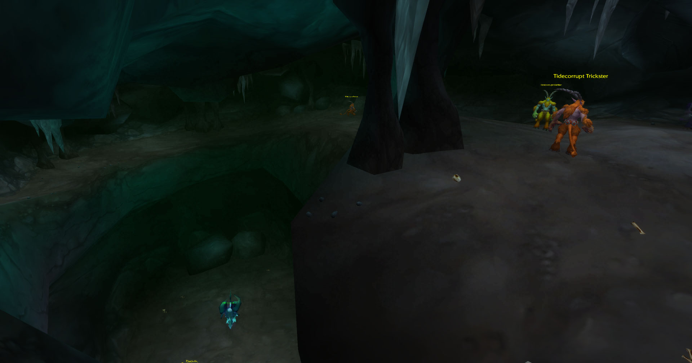
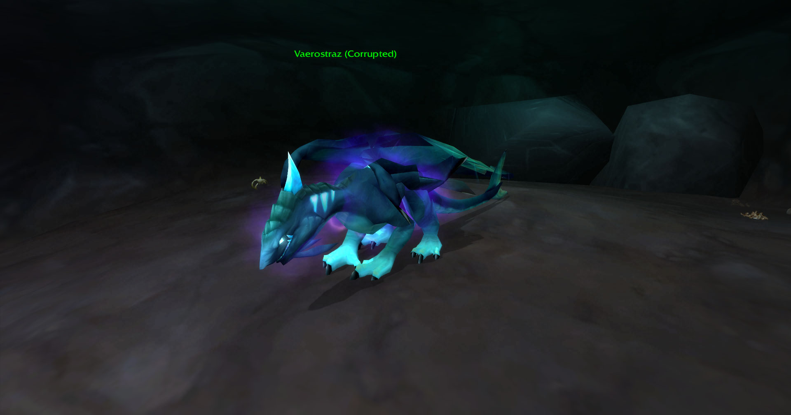
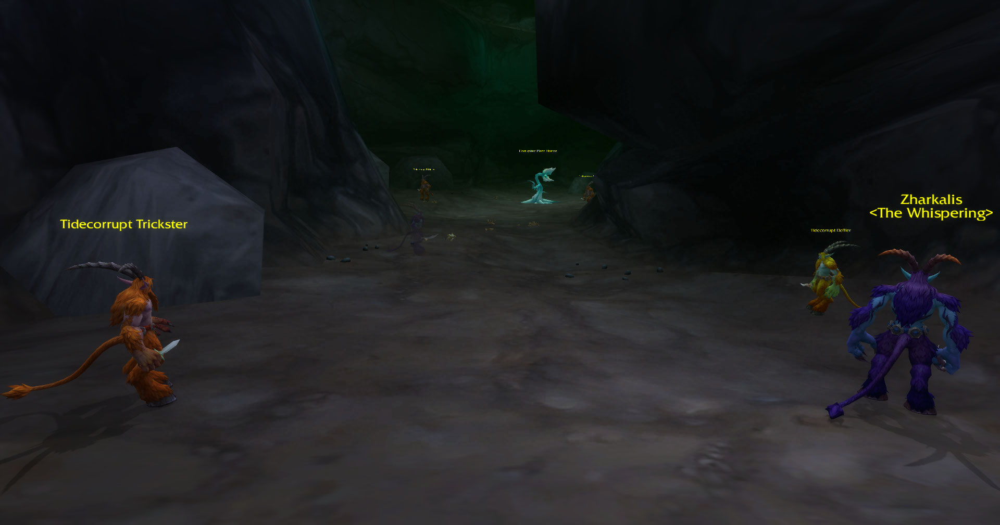

# 🌊 Oceanmane Village & The Corrupted Depths - Custom WoW Expansion  

A custom **level 80 five-player questline & boss encounter** for **AzerothCore (WOTLK 3.3.5)**, featuring **Oceanmane Village**, a lost Tauren outpost hidden within **Silithus**, and the **corruption threatening its survival**.  

---

## 📖 **Oceanmane Village: A Lost Tauren Settlement Rediscovered**  
Nestled along the **southwestern shores of Kalimdor**, **Oceanmane Village** was an **ancient Tauren settlement** once thought lost to the sands of **Silithus**. Now restored, it offers adventurers a **bustling outpost** of Tauren culture, **essential services**, and **secrets buried in its sacred caves**.  

### **What Awaits You?**  
🏕️ **A Fully Functional Outpost** – Explore the **reclaimed Tauren village** featuring **coastal huts, totems, a fishing pier, and a vast underground cave system**.  

🎣 **Dynamic Fishing Vendor** – **John the Fisherman (601005)** travels between the **pier, village center, and hidden fishing spots**, selling **unique bait and gear**.  

⚒️ **Essential Services** – Crafting, mailing, and vendors such as **Khorran Ironsong (601006)** for Blacksmithing and **Talu Whisperreed (601007)** for Herbalism provide **player support**.  

🐂 **Oceanmane Villagers** – Meet distinct **Tauren NPCs**, each with a **unique role**, from **weapon merchants and armor traders to warrior trainers and bankers**.  

🌀 **Sacred Oceanmane Caves** – A **labyrinth beneath the village** leads to **Zharkalis the Whispering (601022)**, a satyr who has begun **corrupting Vaerostraz the Tidekeeper**, the Oceanmane Guardian Dragon.  

---

## 🏆 **Questline: "The Corrupted Depths"**  
Elder Rohatu (601017), the Oceanmane Village elder, seeks **brave champions** to **purge the corruption** from their sacred caves.  

🔹 **Quest #1 - Clearing the Corruption (100051)**  
- Defeat **Tidecorrupt Stalker (601018)**, **Tidecorrupt Trickster (601019)**, and **Tidecorrupt Defiler (601020)**.  
- Banish **Twisted Oceanmane Spirits (601021)**, fallen ancestors turned into wraiths.  

🔹 **Quest #2 - The Tides of Corruption (100050)**  
- **Zharkalis the Whispering has conjured a monstrous plant horror** to block any who would try to stop him.  
- The **massive, corrupted horror** must be defeated to open the path to Zharkalis.  
- With the **Corrupted Plant Horror slain**, adventurers can now **confront Zharkalis the Whispering** himself.  
- **Zharkalis' dark magic** has corrupted the **Oceanmane Guardian Dragon, Vaerostraz the Tidekeeper**. 
- **Defeat Zharkalis**, break his **dark hold**, and **restore Vaerostraz to his rightful form**.  

---

## ⚔️ **Enemies & Bosses**  
| Creature ID | Name                      |
|------------|---------------------------|
| 601018     | Tidecorrupt Stalker       |
| 601019     | Tidecorrupt Trickster     |
| 601020     | Tidecorrupt Defiler       |
| 601021     | Twisted Oceanmane Spirit  |
| 601022     | Zharkalis the Whispering  |
| 601023     | Corrupted Plant Horror    |

---

## 👥 **NPCs & Oceanmane Villagers**  
| Creature ID | Name                     | Sub Name                  
|------------|-------------------------|--------------------------|
| 26365      | Taunka Orphan           |                          |
| 31144      | Grandmaster's Training Dummy |                      |
| 601005     | John the Fisherman      | Pro Angler               |
| 601006     | Khorran Ironsong        | Blacksmithing Trainer    |
| 601007     | Talu Whisperreed        | Herbalism Trainer        |
| 601008     | Kautha Windstring       | Bowyer & Fletching Goods |
| 601009     | Boruun Stormhide        | Leather Armor Merchant   |
| 601010     | Hretok Wavepiercer      | Sword & Dagger Merchant  |
| 601011     | Othiri Tideflame        | Cooking Trainer          |
| 601012     | Grakhan Deepcurrent     | Warrior Trainer         |
| 601013     | Tamuun Saltbinder       | Banker                   |
| 601014     | Mazali Seastrider       | Reagents                 |
| 601015     | Rohka Fartrader         | Auctioneer                         |
| 601016     | Crestwatcher            | Guards                         |
| 601017     | Elder Rohatu            | Oceanmane Elder    *(Quest Giver #100050)*      |
| 601024       | Vaerostraz (Corrupted) |
| 601025       | Vaerostraz the Tidekeeper |
| 601026     | Thalgrun Wavebreaker | *(Quest Giver #100051)* |
| 601030     | Cowlie                  | The Milker               |
| 601031     | Cutie Pig               | For Alice                |

---
##  **Quest**

| Quest  ID | Name                      |
|------------|---------------------------|
| 100050     | The Tides of Corruption       |
| 100051    | Cleansing The Corruption     |

---
##  **Gameobjects**

| Game Object Name              | ID      |
|--------------------------------|---------|
| Forge               | 192572  |
| Anvil                | 192019  |
| Mailbox                       | 195629  |
| Fishing Chair                 | 186475  |
| Oily Blackmouth School        | 180682  |
| School of Northern Salmon     | 189290  |
| Deep Sea Monsterbelly School  | 192053  |

---

## 📜 **Installation**  

1. **Ensure your AzerothCore server is running** (3.3.5 WOTLK).  

2. **Execute the SQL scripts** in your database:  
   - `Enemies.sql` – Adds corrupted satyrs, spirits, and Zharkalis.  
   - `NPC.sql` – Adds Elder Rohatu, Vaerostraz, Townsfolk, Vendors, Guards, etc.  
   - `GameObjects.sql` – Adds world objects for Oceanmane Village.  

3. **Place the Lua script** (`TidesofCorruption.lua` and `CrestwatcherGuards.lua') in your `scripts` folder.  

4. **Restart the server** to apply changes.  

---

## 🏆 **Acknowledgment**  
This project builds upon the **Silithus Camp SQL work by StygianTheBeast**, which inspired the restoration of **Oceanmane Village**. Their original work laid the foundation for expanding content in underdeveloped zones, allowing for new NPCs, quests, and world-building elements to enhance the player's experience.

🔗 **Silithus Camp ** [https://stygianthebest.github.io/projects/sql-silithuscamp/](https://stygianthebest.github.io/projects/sql-silithuscamp/)

By taking inspiration from these community-driven efforts, **The Tides of Corruption** expansion brings fresh, lore-friendly content to World of Warcraft's Silithus coastline, adding new enemies, an engaging storyline, and a fully realized faction presence in Oceanmane Village.

## Screenshots

### Screenshot 1

### Screenshot 2

### Screenshot 3

### Screenshot 4

### Screenshot 5

### Screenshot 6

### Screenshot 7

